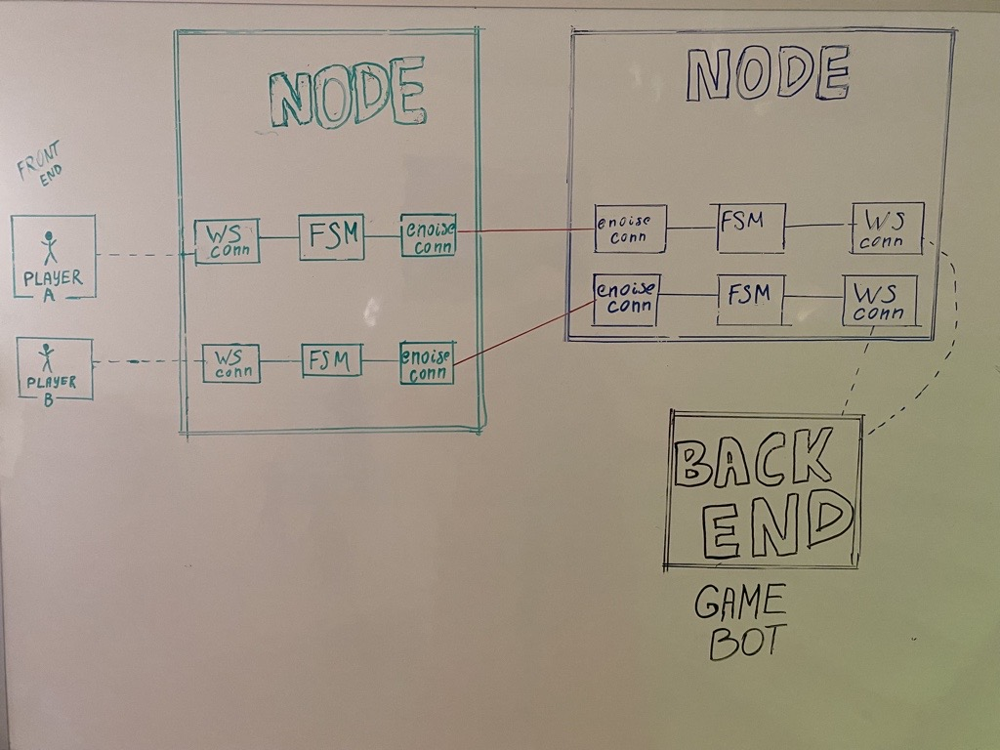

# State Channels
State Channels allow entities to communicate with each other with the goal of collectively computing some function `f`. This `f` can be as simple as "send 0.1 coins every minute" or it could represent a decentralised exchange. These functions are, in our case, represented by Smart Contracts and just like any legal contract, we need an arbiter in case one party tries to act maliciously. This arbiter is the blockchain. 
For more information visit [here](https://github.com/aeternity/protocol/tree/master/channels)

# State Channel Demo
A demo use case of æternity's State Channels. Users can play a thousand+ rounds of rock-paper-scissors games through the æternity blockchain by deploying a game-rules Smart Contract into State Channels.


# Table of Contents 
1. [Installation](#installation)
2. [Running Options](#running-options)
3. [Channel Communication between Apps](#channel-communication-between-apps)
4. [Helpful links](#helpful-links)

**[Step by step channel guide](TUTORIAL.md)**

> 💚 Interested in the vue.js version? You can find it [here](https://github.com/aeternity/state-channel-demo/tree/vuejs)

# Installation 

```bash
cd contract && npm install
cd ../client && npm install
cd ../server && npm install
```


# Running options
## Local Node and not on connected with an æternity network

|Terminal #number |  Explanation  |       Command     |
|:----------:|:-------------:|------|
|#1 | Start node |  `docker-compose up` |
|#2 | Start server |    `cd server && npm run dev`   |
|#3 | Start client | `cd client && npm run dev` |

## Deployed node and on testnet

|Terminal #number |  Explanation  |       Command     |
|:----------:|:-------------:|------|
|#1 | Start server |    `cd server && npm run dev:testnet`   |
|#2  | Start client | `cd client && npm run dev:testnet` |

## Services

| name             | port |
| ---------------- | ---- |
| frontend | 8000 |
| backend - nodejs | 3000 |
| æternity node   | 3013 |
| Sophia Compiler  | 3080 |
| Websocket server | 3014 |


# Channel Communication between Apps




## Introduction

Except the funding & channel initialization phase (further explained below) where the demo accounts are funded and the required information for channel initialization is exchanged, the client application (frontend) and the server application (backend) always communicate via WebSocket to their configured node.

The æternity node runs 3 processes for each State Channel that a user initializes:
- WebSocket connector which handles communication between client and node
- Finite State Machine (FSM) which is responsible for:
    - Enabling validation of State Channel transactions through root hash.
    - Building and enriching State Channel trees.
    - Tracking any possible disputes.
    - Warning the client so one could take an appropriate action.
- enoise connector which handles encrypted communication between æternity nodes via [Noise Protocol](https://noiseprotocol.org)


Note:
- While these 3 processes in the æternity node abstract a lot of the complexity from the developers and users, it is not required to use it. Depending on the use case, you might want to develop your own implementation to handle off-chain communication & updates (transactions). In any case you should make sure to keep track of on-chain State Channel updates by connecting to an æternity node to react in case the counterpart tries to cheat you.
- The demo currently uses the same æternity node for both, the client application and the server application. The behavior is the same as if client and server application would both use their own node, which is how it is displayed in the communication diagram above.


## Server application / Backend

The server application (backend) can be seen as the game session manager. It is responsible for:

- **Funding Phase**
  - Accept requests from users (channel `responder`) that provide their:
    - Account address (ak_...)
    - Node host (e.g. http://localhost:8000)
    - Node port (e.g. 3013)
  - Generate a new account (bot player - channel `initiator`) for each request
  - Fund the bot player account by requesting coins from [Faucet æpp](https://faucet.aepps.com/)
  - Respond to users request with the mutual channel configuration. Read more about the channel configuration [here](https://github.com/aeternity/protocol/blob/master/node/api/channels_api_usage.md#channel-establishing-parameters)

- **Channel Initialization Phase**
  - When both accounts have enough funds, the server app will run `Channel.Initialize(channelConfig)` which will execute the on-chain transaction `ChannelCreateTx` and proceed in a listening-for-events state such as a 'channel open' confirmation
  - Also, as the initiator, bots are responsible for deploying the contract on channel.
  
- **Game Rounds** 
  - One channel configuration option is the `sign` function. This function runs whenever any party executes an off-chain transaction which needs to be co-signed by both parties. Therefore whenever the other party makes their move, we can confirm it here and then respond with a next contract call.
  
- **Closing Phase**
  - Scenario 1: User wants to close the channel
    - In this happy path, the user calls an on-chain transaction called `ChannelCloseMutualTx`. The bot co-signs it and the final channel state is posted on-chain. The corresponding balances are returned to their owners and the channel status is finalized in `closed`.
  - Scenario 2: User went idle - timeout occured
    - If the channel status changes to `died`, we assume that the user closed their window and a timeout occured. In this case, in order for the channel to close, the bot has to:
      - Execute on-chain [`ChannelCloseSoloTx`](https://github.com/aeternity/protocol/blob/master/channels/ON-CHAIN.md#channel_close_solo)
      - Execute on-chain [`ChannelSettleTx`](https://github.com/aeternity/protocol/blob/master/channels/ON-CHAIN.md#channel_settle). Keep in mind that there's a window where the user can dispute the channel closure. This window is defined in the channel configuration with the `lockPeriod` option. In this demo, `0` is used as value in order to reduce delays.


## Client application / Frontend

On the other hand, the **client application** (frontend) is responsible to do the following:
- Generate a new local player account
- Fund the local player account by requesting coins from [Faucet æpp](https://faucet.aepps.com/)
- POST request to the server application (in order to fetch the mutual channel configuration) by providing:
  - Account address (ak_...)
  - Node host (e.g. http://localhost:8000)
  - Node port (e.g. 3013)
- Initialize a channel with the given configuration
- Verify that the deployed contract has the correct source code
- Respond to other party's actions
- Execute `ChannelCloseMutualTx`
- Reconnect to channel in cases of window reload

Note:
- After the closing phase, both (client & server application) will send the funds back to the Faucet æpp.

# FAQ

## How do I build my own State Channel application?

You can find the steps at the complete [State Channel Tutorial Guide](TUTORIAL.md).


## Is State Channel Demo provably fair?

State Channels offer an innovative solution, where off-chain transactions are executed on top of blockchain technology. 

The State Channel protocol inherently offers security to the demo!

State Channel transactions are ruled by co-signed Smart Contracts. Each party shall verify the content of a transaction before signing it. Those transactions can be off-chain such as `ContractCallTx`, `SpendTx` or on-chain such as `MutualCloseChannelTx`. All transactions need to be co-signed by both parties.

State Channel Demo Game verifies also counterparty transactions. At each transaction, calldata content is decoded utilizing æternity's [calldata lib](https://github.com/aeternity/aepp-calldata-js) which is integrated in the SDK. Each party can utilize this library in order to verify that the opponent is following the anticipated flow of the game (calling the right contract methods). If they accept opponent's transaction, then they can co-sign it, otherwise they will refuse to co-sign.

## How do State Channel Demo Game transactions take place?

As rock, paper, scissors is a turn based game and the move of each player needs to be co-signed by the opponent in order to be executed, the move of the initial player is hashed. The other party receives the off-chain transaction with calldata containing the hash, where he/she can **only** confirm the method the opponent called (e.g. opponent picked a move) but not see the actual move.

After co-signing the opponent's hashed move, the next required step is for the second player to make his/her move. This is achieved by calling the corresponding contract method which does not hash the pick (the opponent's move is already sealed in the channel's state tree).

Now that both players have picked, the contract requires from the first player to reveal his move. Revealing is required as only the first player has the key to the hash. With the execution of it, the winning party receives the stake. In the case of a draw, the stake is returned to both players.


## If one party refuses to reveal their move, how this can be disputed?

At first player's side, he/she can inspect the calldata (second player non-hashed move), examine the move the opponent picked and choose to make an inappropriate action (e.g. not revealing his move, because he/she found out that will lose after inspecting opponent's move). 

`RockPaperScissors` Demo Smart Contract provides disputing methods to use on-chain with `ForceProgressTx`, such as [`player1_dispute_no_reveal`](https://github.com/aeternity/state-channel-demo/blob/develop/contract/contracts/RockPaperScissors.aes#L96) which can be used in cases where the first player did not reveal his move.

In that case, the second player can raise an on-chain dispute utilizing transaction force progress mechanism [ForceProgressTx`](https://github.com/aeternity/protocol/blob/master/channels/ON-CHAIN.md#forcing-progress). 

With a force progress transaction, the contract state is broadcast on-chain where the game move is confirmed by on-chain computation.

Note:
- Hashing the move is required in this demo because a winner will be determined based on a decision which should happen simultaneously. For this reason, a reaction time is defined in the Smart Contract. The `ForceProgressTx` will only be successful, if the defined reaction time has passed. 
- Considering that the game would be "4 wins", the moves wouldn't need to be hashed. Every move could be open. In this case it would be more likely that the opponent refuses to co-sign the winning move. In such scenario, a `ForceProgressTx` can immediately be executed to enforce the winning move, because no reaction time is needed.


# Helpful Links
- **[State Channel Demo Page](https://statechannel.aepps.com)**
- **[State Channel Demo Tutorial](TUTORIAL.md)**
- [On-Chain channel transactions](https://github.com/aeternity/protocol/blob/master/channels/ON-CHAIN.md)
- [Off-Chain channel transactions](https://github.com/aeternity/protocol/blob/master/channels/OFF-CHAIN.md)
- [Channels API usage](https://github.com/aeternity/protocol/blob/master/node/api/channels_api_usage.md)
- [Channel WS API](https://github.com/aeternity/protocol/blob/master/node/api/channel_ws_api.md)
- [Node level channel examples](https://github.com/aeternity/protocol/tree/master/node/api/examples/channels)
- [Aeternity Node API](https://api-docs.aeternity.io/) 
- [Aeternity SDK](https://github.com/aeternity/aepp-sdk-js)
- [Run an Aeternity Node with Docker](https://docs.aeternity.io/en/stable/docker/)
- **[Back to repo](https://github.com/aeternity/state-channel-demo)**
